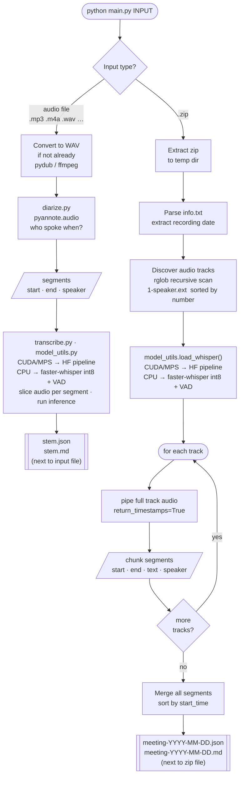

# transcriber

A local, offline-capable pipeline that diarizes and transcribes an audio file.
No cloud APIs. No subscriptions. Everything runs on your machine.

---

## What it does

Two modes:

### Single audio file

1. **Diarization** — identifies *who* is speaking and *when*, using [pyannote.audio](https://github.com/pyannote/pyannote-audio).
2. **Transcription** — converts each speaker's audio segment to text using [OpenAI Whisper](https://huggingface.co/openai/whisper-large-v3-turbo). The backend is chosen automatically based on the available hardware:
   - **CUDA / MPS** — HuggingFace Transformers pipeline
   - **CPU** — [faster-whisper](https://github.com/SYSTRAN/faster-whisper) with CTranslate2 int8 quantisation (4–8× faster than the standard pipeline on CPU, with built-in VAD to skip silent regions)

While running, progress is printed live as each segment is transcribed:

```
Processing: interview.mp3
Running diarization…
Transcribing 38 segment(s)…

  00:00.480 → 00:03.820  SPEAKER_00
    Hey, how's it going?
  00:04.100 → 00:07.650  SPEAKER_01
    Pretty good, just finished the report.
  …

Done. Writing output files…
  /path/to/interview.json
  /path/to/interview.md
```

A tqdm progress bar also tracks overall segment count in the terminal.

Two output files are written next to the source audio:

- **`audiofile.json`** — full results as a JSON array
- **`audiofile.md`** — formatted Markdown transcript

The Markdown transcript looks like:

```markdown
# Transcript: interview.mp3

*Generated: 2026-04-20 20:45 UTC*

---

[00:00.480 → 00:03.820] **SPEAKER_00:** Hey, how's it going?

[00:04.100 → 00:07.650] **SPEAKER_01:** Pretty good, just finished the report.

[00:08.000 → 00:12.340] **SPEAKER_00:** Nice. Did you send it over yet?
```

### Multi-track zip

Pass a zip of per-speaker audio files instead of a single audio file. Each speaker has their own track; diarization is skipped entirely. All tracks are transcribed with Whisper and the segments are merged chronologically. See the **Usage** section below for full details.

---

## Requirements

- Python 3.10+
- [ffmpeg](https://ffmpeg.org/) installed and on your `PATH` (for audio conversion)
- GPU strongly recommended for reasonable speed:
  - **NVIDIA:** CUDA-capable GPU
  - **Apple Silicon (M1/M2/M3):** Metal (MPS) is used automatically
  - **CPU-only:** supported — on CPU, `faster-whisper` with int8 quantisation is used automatically, which is substantially faster than the standard HuggingFace pipeline on CPU

---

## Installation

```bash
# Clone and enter the repo
git clone <repo-url>
cd transcriber

# Create and activate a virtual environment
python -m venv .venv
source .venv/bin/activate   # Windows: .venv\Scripts\activate

# Install dependencies
pip install -r requirements.txt
```

---

## Setup

### 1. Copy the example env file

```bash
cp .env.example .env
```

### 2. Set your HuggingFace token (first run only)

The diarization model (`pyannote/speaker-diarization-community-1`) is hosted on
HuggingFace. On the first run, it is downloaded automatically. If the model page
requires you to accept terms, you'll need to:

1. Create an account at [huggingface.co](https://huggingface.co)
2. Visit the [model page](https://huggingface.co/pyannote/speaker-diarization-community-1) and accept the conditions
3. Go to [huggingface.co/settings/tokens](https://huggingface.co/settings/tokens) and create a token
4. Add it to your `.env`:

```
HF_TOKEN=hf_yourtoken
```

The Whisper model downloads automatically with no account needed.

---

## Usage

### Single audio file

```bash
python main.py path/to/audio.mp3
```

Any format ffmpeg supports works: `.mp3`, `.m4a`, `.wav`, `.flac`, `.ogg`, etc.

On first run, the models are downloaded from HuggingFace (~2 GB total) and
cached locally. Subsequent runs load from cache and are much faster.

### Multi-track zip (per-speaker recording)

```bash
python main.py path/to/recording.zip
```

Use this when you have a separate audio track per speaker — for example, a
recording app that saves each participant's audio independently. Diarization is
skipped entirely; speaker identity comes from the filename.

**Zip layout:**

```
info.txt        ← recording metadata (see below)
1-alice.aac     ← audio track for speaker "alice"
2-bob.ogg       ← audio track for speaker "bob"
3-carol.m4a     ← audio track for speaker "carol"
```

Audio files must be named `[number]-[speaker].[ext]`. The number controls
sort order (cosmetic); the speaker label is taken from the filename stem after
the first `-`. Audio files can be at the top level or inside subdirectories —
the zip is scanned recursively.

**`info.txt` format** (one line is sufficient):

```
Start time:  2026-04-27T11:51:12.426Z
```

The date is extracted from this line and used to name the output files. If
`info.txt` is absent or the line is missing, today's date is used instead.

**Output** (written next to the zip file):

- **`meeting-YYYY-MM-DD.json`** — all segments as a JSON array
- **`meeting-YYYY-MM-DD.md`** — Markdown transcript sorted chronologically

Each track is transcribed independently using Whisper's chunk-level timestamps,
then all segments from all speakers are merged in chronological order.

---

## Offline mode

Once the models have been downloaded at least once, you can prevent all network
calls by setting in your `.env`:

```
HF_HUB_OFFLINE=1
```

In offline mode:
- Both models load directly from the local HuggingFace cache
- No HF token is required
- If a model isn't cached yet, the script fails with a clear error

To find where models are cached:

```bash
python -c "from huggingface_hub import constants; print(constants.HF_HUB_CACHE)"
```

To move the cache to a different disk (e.g. if your home partition is small),
add to `.env`:

```
HF_HOME=/mnt/data/huggingface
```

---

## How the pipeline works



---

## Running the tests

The test suite requires only `pytest` — **no GPU, no model downloads, no
`ffmpeg`**. All ML dependencies (`torch`, `transformers`, `pyannote`, `pydub`,
etc.) are stubbed out by `tests/conftest.py` at import time, so the suite runs
in any plain Python environment.

```bash
pip install pytest
pytest tests/ -v
```

121 tests across five files:

| Test file | What it covers |
|---|---|
| `tests/test_model_utils.py` | `offline()`, `FasterWhisperAdapter`, `load_whisper()` HF and CPU paths |
| `tests/test_transcribe.py` | `format_time` (including hours), `transcribe()`, `pipe=` injection |
| `tests/test_diarize.py` | Token resolution, annotation parsing, `diarize()` |
| `tests/test_transcribe_zip.py` | `parse_info_txt`, speaker extraction, writers, `_transcribe_track`, `_safe_extractall`, `process_zip()` |
| `tests/test_main.py` | `_to_wav`, output writers, `main()` dispatch and cleanup |

---

## Module reference

| File | Role |
|---|---|
| `main.py` | CLI entry point — parses args, dispatches to audio or zip mode, writes output files |
| `diarize.py` | Speaker diarization via `pyannote.audio` — returns `{start, end, speaker}` segments |
| `transcribe.py` | Whisper transcription per diarized segment — slices audio, runs inference, prints progress |
| `transcribe_zip.py` | Full zip pipeline — extract (with path-traversal protection), parse `info.txt`, transcribe each track, merge chronologically |
| `model_utils.py` | Shared Whisper model loading — `offline()` and `load_whisper()` used by both transcription modules |

All modules auto-detect the best available device: **CUDA → MPS (Apple Silicon) → CPU**.
On CUDA and MPS, a HuggingFace `transformers` pipeline is used (`float16` on CUDA, `float32` on MPS; SDPA attention on CUDA).
On CPU, `faster-whisper` with CTranslate2 int8 quantisation is used instead — typically 4–8× faster than the HuggingFace pipeline on CPU, with built-in VAD filtering to skip silent regions.

---

## Models

| Model | Size | Purpose |
|---|---|---|
| `pyannote/speaker-diarization-community-1` | ~300 MB | Speaker diarization |
| `openai/whisper-large-v3-turbo` | ~1.6 GB | Speech-to-text (CUDA / MPS) |
| `Systran/faster-whisper-large-v3-turbo` | ~800 MB | Speech-to-text (CPU, int8) |

All models are cached by HuggingFace in `~/.cache/huggingface/` after the first download.
The correct Whisper variant is selected automatically based on the detected device.

---

## Troubleshooting

**`FileNotFoundError: Audio file not found`**
Double-check the path you passed. Relative paths are resolved from your current
working directory, not from the script location.

**`OSError: ffmpeg not found`**
Install ffmpeg: `sudo apt install ffmpeg` (Ubuntu/Debian) or `brew install ffmpeg` (macOS).

**`OSError: …local_files_only=True…` / model not found in cache**
You set `HF_HUB_OFFLINE=1` but the model hasn't been downloaded yet. Run once
with `HF_HUB_OFFLINE=0` (the default) to download it first.

**CUDA out of memory**
Whisper large-v3-turbo needs ~6 GB VRAM. Switch to a smaller model by editing
the `model_id` default in `transcribe.py` — e.g. `openai/whisper-base` (~150 MB).

**Still slow on CPU**
On CPU, `faster-whisper` with int8 quantisation and VAD is used automatically,
which is substantially faster than the standard HuggingFace pipeline. If it is
still too slow, switch to a smaller model by changing the `model_id` default in
`transcribe.py` and `transcribe_zip.py` — e.g. `openai/whisper-small` — which
maps to the corresponding faster-whisper size automatically.

**MPS errors on Apple Silicon**
Make sure you have PyTorch 2.0+ installed. If you hit unsupported op errors,
the model will need to run on CPU — remove the MPS branch from `_inference_device()`
in `diarize.py` and the MPS check in `model_utils.py` as a workaround.
